# Iromihon Themes

Twenty hostile little native Omarchy themes in one manifest-free collection. The original ten are complete three-wallpaper systems with custom unlock artwork, icon and keyboard choices, launcher/menu/notification treatments, and one additional signature Omarchy shell surface. Each original also has a genuinely reimagined opposite-mode mutation rather than a mechanical palette inversion.

| Original system | Opposite-mode mutation |
|---|---|
| 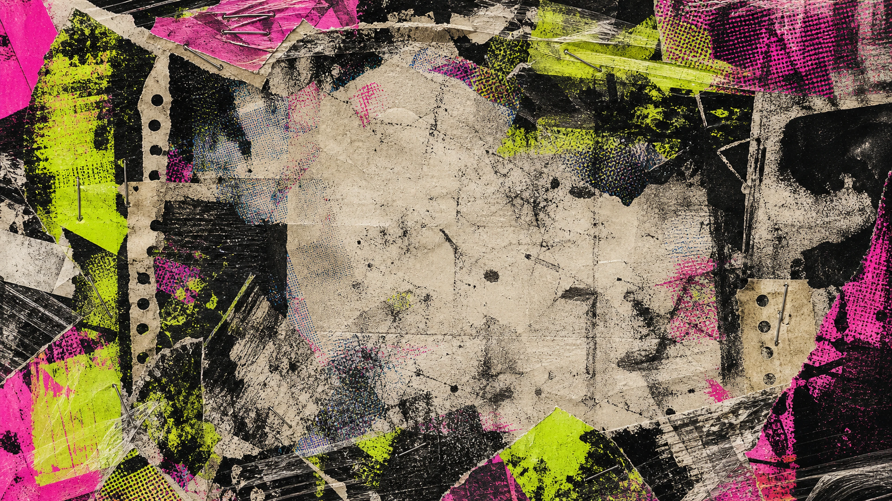<br>**Xerox Riot** — shredded flyers, toner grime, hot pink, and toxic chartreuse. | 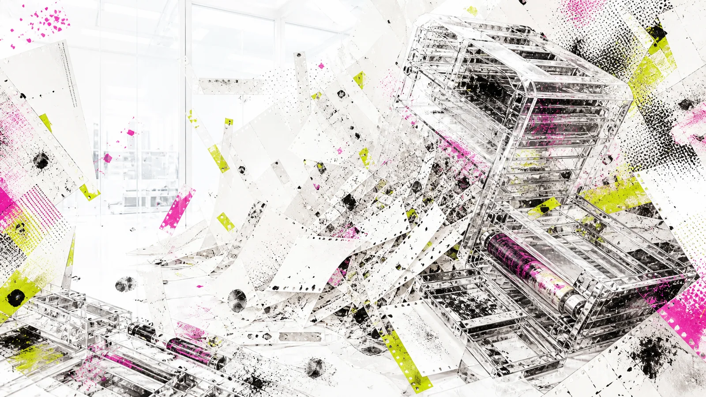<br>**Xerox Riot Cleanroom** — the copier disaster sealed inside a bright evidence lab. |
| 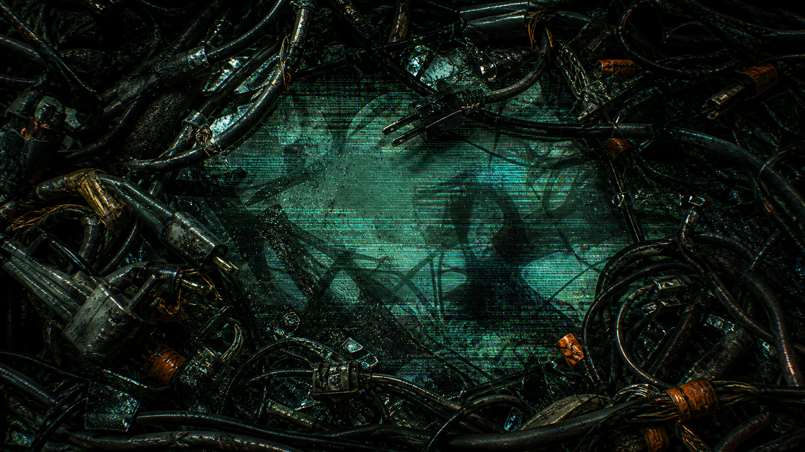<br>**Cable Rat King** — wet circuitry, impossible wiring, oxidized copper, and terminal teal. | 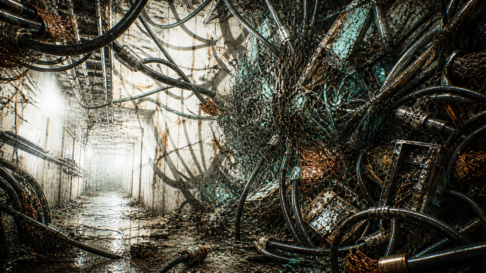<br>**Cable Rat King Emergency Lighting** — the nest under brutal maintenance lamps. |
| 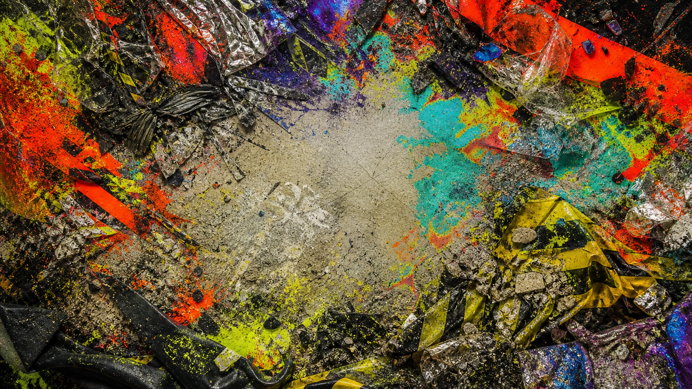<br>**Safety Third** — industrial warning paint, bad decisions, hazard orange, and radioactive lime. | 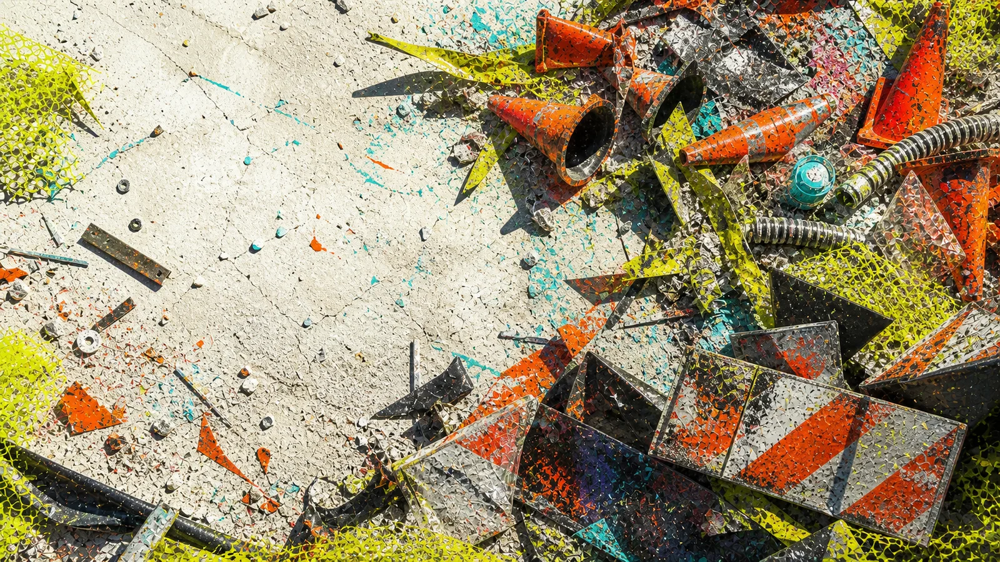<br>**Safety Third Day Shift** — a sun-bleached incident scene still failing inspection. |
| 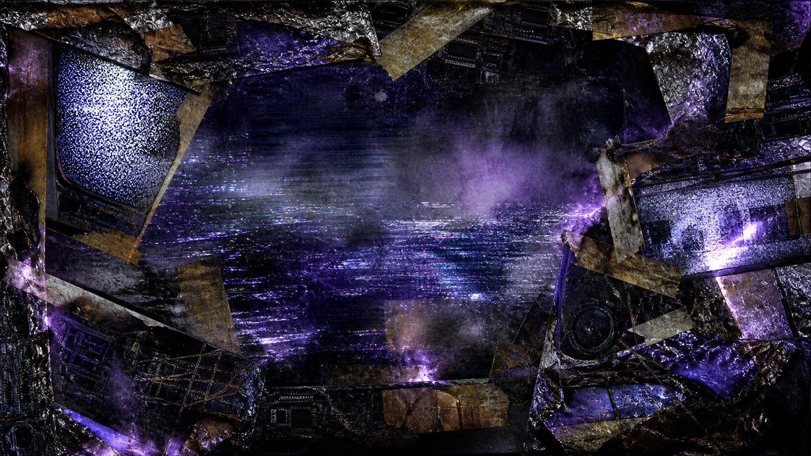<br>**Channel Zero** — dead broadcast equipment, violet signal ghosts, scanlines, and no reception. | 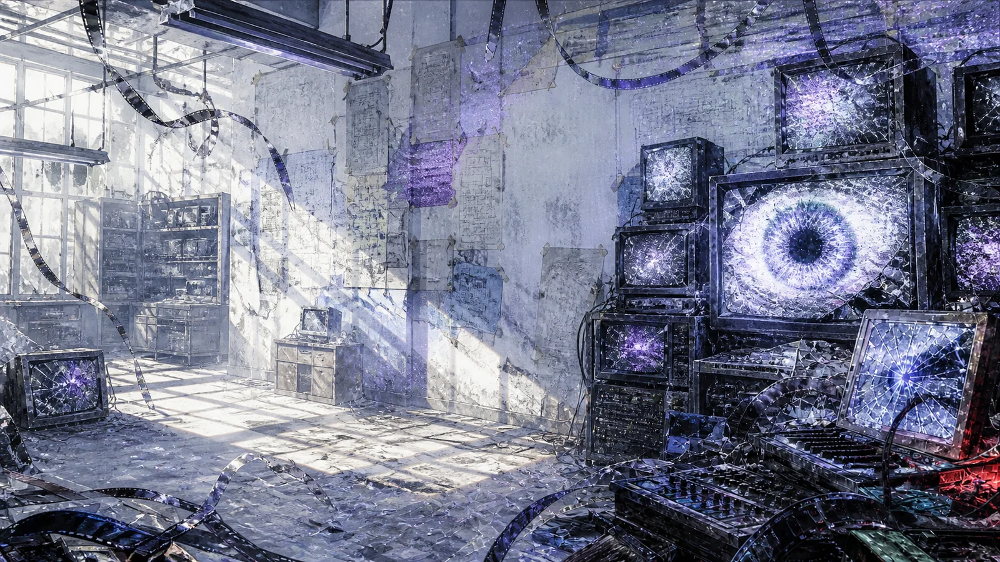<br>**Channel Zero Day Signal** — spectral broadcast debris exposed on a white studio cyclorama. |
| <br>**Thermal Runaway** — receipt avalanches, dying registers, checkout cyan, and refund pink. | 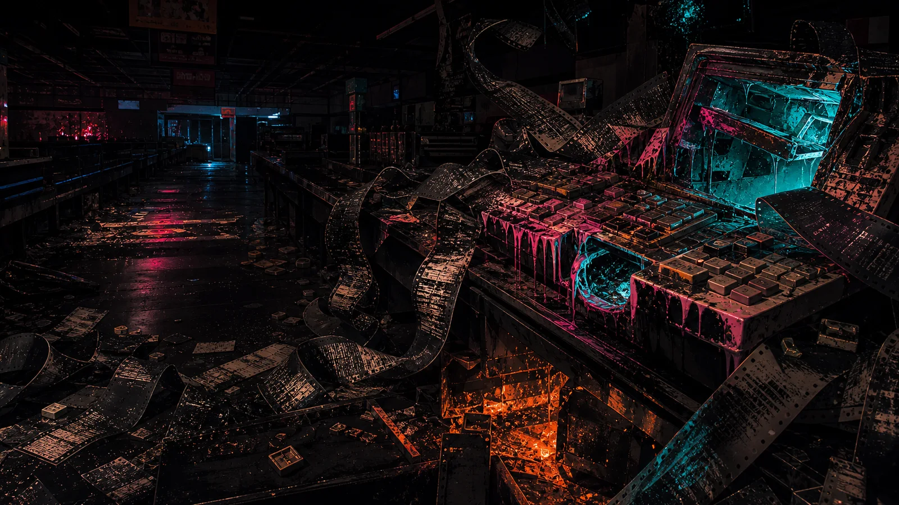<br>**Thermal Runaway Night Shift** — fluorescent receipts burning through a closed register bay. |
| 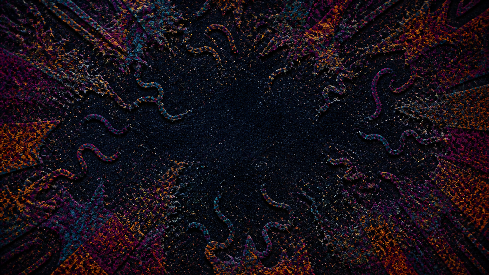<br>**Carpet Burn** — a casino carpet that has started moving. | 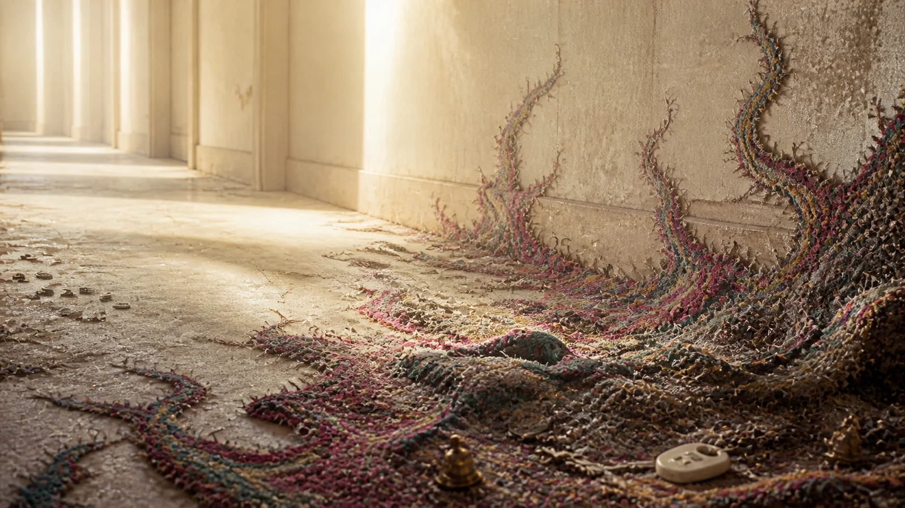<br>**Carpet Burn Daylight** — the infestation dragged into unforgiving lobby daylight. |
| <br>**Pinball Autopsy** — a dead machine opened on the table. | 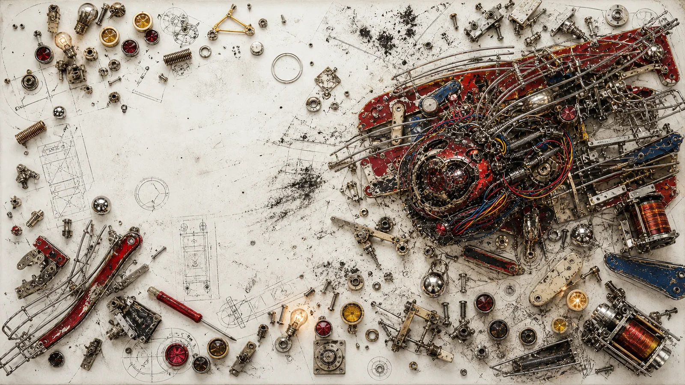<br>**Pinball Autopsy Service Manual** — the machine flattened into a frantic paper schematic. |
| 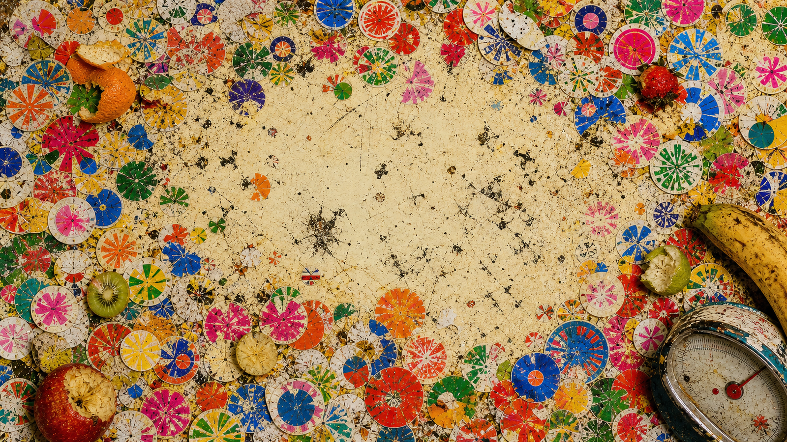<br>**Fruit Sticker Fever** — a produce counter buried in fictional labels. | 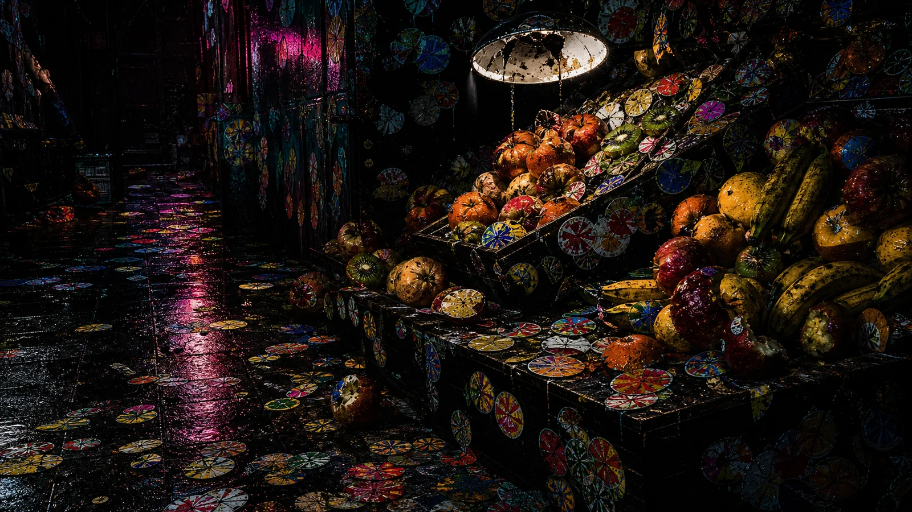<br>**Fruit Sticker Fever After Hours** — fluorescent labels running wild after the market closes. |
| 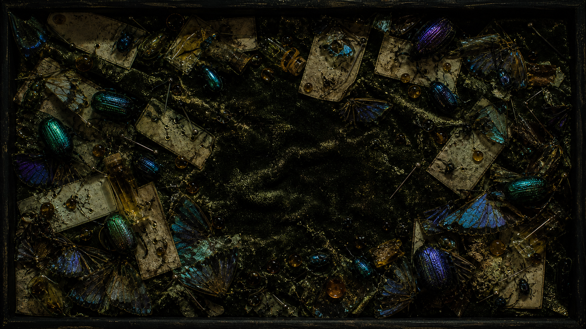<br>**Specimen Leak** — an entomology drawer after containment failure. | 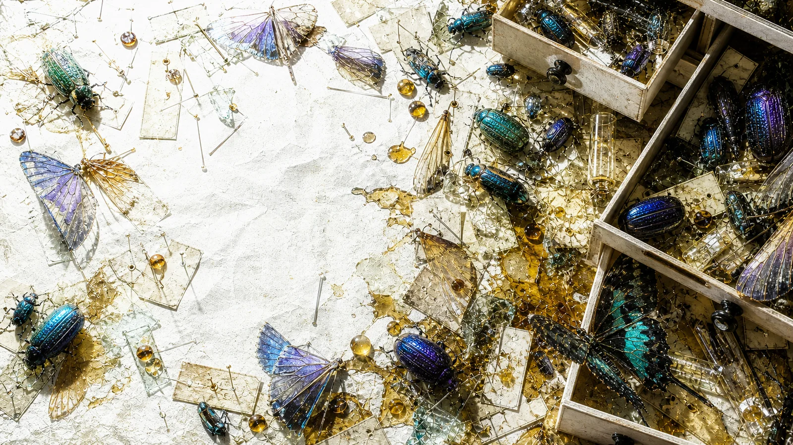<br>**Specimen Leak Bleached** — the outbreak chemically overexposed on a clinical tray. |
| 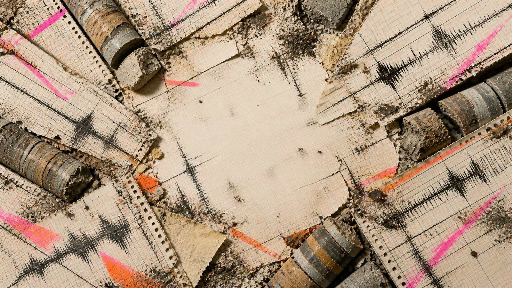<br>**Seismic Panic** — graph paper under geological assault. | 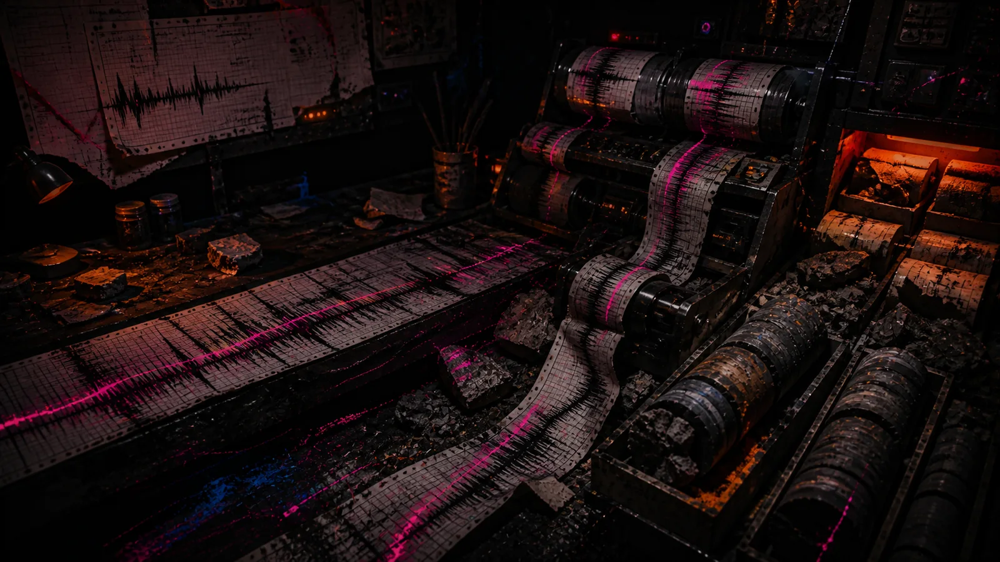<br>**Seismic Panic Night Watch** — neon traces monitoring a fault in total darkness. |

Each child under `themes/<slug>/` is an ordinary native Omarchy theme. [Iromihon](https://github.com/RegionallyFamous/iromihon) browses this repository, shows what each child can change, previews all of its wallpapers, and installs only the child you choose.

## Browse the collection

Install Iromihon on stock Omarchy Quattro:

```bash
omarchy plugin add https://github.com/RegionallyFamous/iromihon.git --enable
omarchy restart shell
```

Open **Iromihon** from Apps. This collection opens automatically on first launch, so no source URL is required. To return after choosing **Change source**, use:

```text
https://github.com/RegionallyFamous/iromihon-themes.git
```

Iromihon clones the collection once, validates every child, and exposes only the themes you deliberately install. Installed children remain ordinary native themes managed by Omarchy.

## Open one child directly

Append any directory slug as the URL fragment when pasting the source into Iromihon:

```text
https://github.com/RegionallyFamous/iromihon-themes.git#xerox-riot
https://github.com/RegionallyFamous/iromihon-themes.git#cable-rat-king-emergency-lighting
https://github.com/RegionallyFamous/iromihon-themes.git#pinball-autopsy-service-manual
https://github.com/RegionallyFamous/iromihon-themes.git#seismic-panic-night-watch
```

Every fragment reuses the same collection clone. Choosing **Change source** forgets the active collection without deleting installed themes.

## Repository contract

There is deliberately no collection manifest and no executable setup code. Iromihon discovers lowercase child slugs directly under `themes/`, validates each native theme, and exposes only the children a user chooses. A child can use the complete current Omarchy theme contract: colors, wallpapers, icons, keyboard colors, unlock art, launcher/menu/notification styling, and narrow shell surface overrides.

See the [full runtime gallery](GALLERY.md) for all twenty themes in a disposable x86_64 Omarchy guest. Artwork production notes and prompt directions live in [ARTWORK.md](ARTWORK.md).

## License

MIT. Artwork and theme configuration are by RegionallyFamous.
